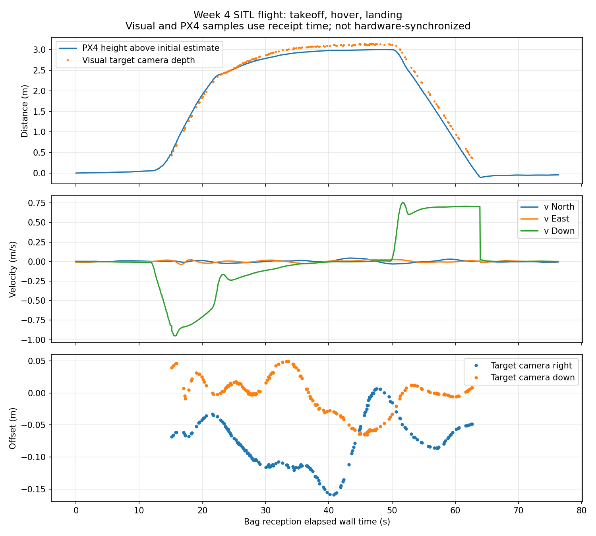
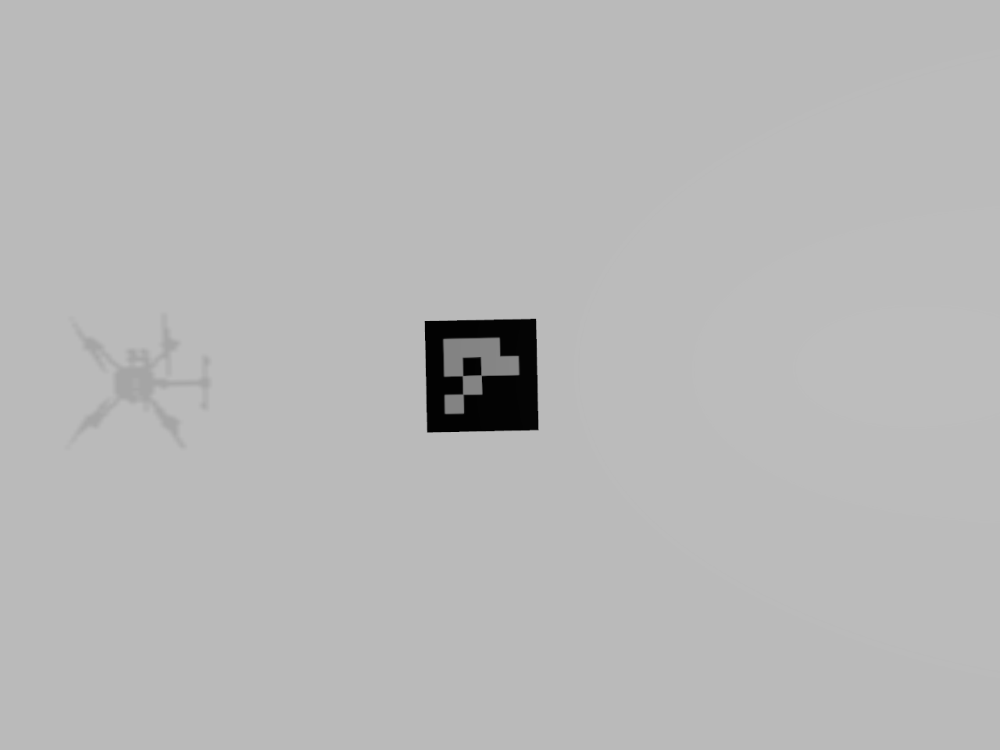

# 第四周：ROS 2 / PX4 / Gazebo 完整仿真飞行

2026-09-05，在 Ubuntu 24.04 / ROS 2 Jazzy 中完成无 Gazebo GUI 的起飞、约 3 米悬停、降落与数据采集。

- [第四周总结](第四周总结.md)
- [实际数据验证](validation.json) · [回放验证](replay_validation.json) · [时间检查](timing_validation.json)
- [位置速度 CSV](position_velocity.csv) · [目标相对位置 CSV](target_camera.csv)
- [脚本](scripts/)：包含主动飞行控制程序，运行前请阅读总结。
- [完整原始 rosbag（无损压缩）](rosbag.tar.gz)：解压约 958 MiB，272 帧原始图像及完整遥测，未降采样。





## 解压和检查

在本目录执行：

```bash
tar -xzf rosbag.tar.gz
sha256sum -c SHA256SUMS
source /opt/ros/jazzy/setup.bash
source /home/drone/ros2_px4_ws/install/setup.bash
ros2 bag info bag
```

## 隔离回放

```bash
ROS_DOMAIN_ID=74 ros2 bag play bag --exclude-topics /fmu/in/vehicle_command
```

用于逐帧完整接收的图像订阅应使用 RELIABLE QoS；本次 BEST_EFFORT 回放曾丢帧，可靠订阅验证全部数量匹配。

目标位置为相机光学坐标系下的视觉估计；PX4 与相机时间轴尚未严格同步。文档中的 `/home/drone/...` 是原采集环境路径，脚本保留现场版本，迁移环境时需要调整路径。
